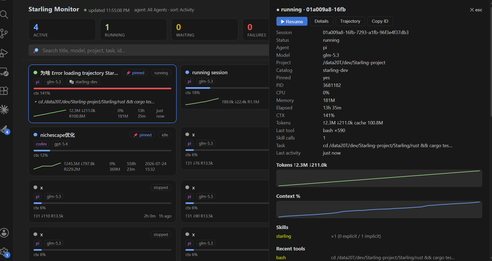
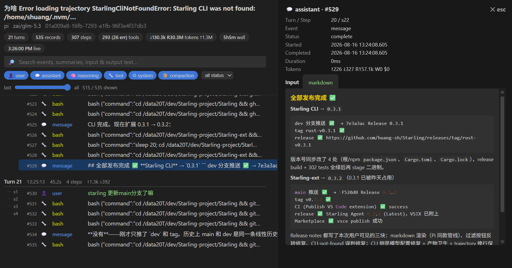

<p align="center">
  English | <a href="README.zh-CN.md">简体中文</a>
</p>

# Starling Agent

<p align="center">
  
</p>

VS Code monitor and workspace for Claude Code, Codex, and Pi sessions: live status, catalogs, projects, model profiles, resume, and fork.

It works with the Starling CLI and turns local agent history into focused Monitor, Catalog, Projects, and Models views, plus Starling Chat in VS Code's right sidebar.

Current release: **0.3.1**

- VS Code Marketplace: [`huangsh.starling-ai`](https://marketplace.visualstudio.com/items?itemName=huangsh.starling-ai)
- GitHub Release: [`v0.3.1`](https://github.com/huang-sh/Starling-ext/releases/tag/v0.3.1)
- CLI package: [`starling-ai`](https://www.npmjs.com/package/starling-ai)

The GitHub release includes the packaged VSIX:

```text
starling-ai-0.3.1.vsix
```

## Requirements

The extension requires VS Code 1.106 or newer so Starling Chat can be contributed directly to the secondary (right) sidebar.

Install the Starling CLI first:

```bash
npm install -g starling-ai
```

Then make sure VS Code can find the `starling` command:

```bash
starling --help
```

If VS Code cannot find `starling` on `PATH`, set `starling.cliPath` to the npm-installed `starling` entry point in VS Code settings. Starling Chat needs that wrapper to locate its SDK Host; a standalone native binary requires explicit `STARLING_PI_SDK_HOST` and `STARLING_PI_SDK_NODE` environment variables.

When the extension starts and cannot find the Starling CLI, it prompts you to install it with:

```bash
npm install -g starling-ai
```

You can also use the prompt to open the `starling.cliPath` setting.

Starling Chat requires the current `starling-ai` npm package (0.3.1 or newer) on Node.js 22.19 or newer. The CLI bundles the Pi SDK dependency (range `>=0.82.0`) and hosts it directly; it does not launch `pi --mode rpc`, so a separate Pi CLI installation is unnecessary for Chat. The VS Code extension itself does not bundle or import the SDK.

## Views

### Starling Chat

Open **Starling: Open Starling Chat** to show it in VS Code's secondary (right) sidebar. The view connects to the Starling CLI's direct Pi SDK host and supports:

- Streaming assistant text and thinking.
- Live tool start, progress, result, and error cards.
- Follow-up messages while Pi is busy.
- Stopping the current turn and starting a fresh session.
- Resuming a historical Pi session by its absolute session-file path.
- Pi extension confirm, select, input, editor, and notification requests through native VS Code UI.

The chat uses the first workspace folder as its working directory. Set `starling.chatPiSetting` to a Starling Pi model-profile name, or leave it empty to use the SDK's default model settings. Closing the view cancels pending UI requests and closes the managed SDK host through stdin before using process signals as a timeout fallback.

The view follows VS Code Workspace Trust. An untrusted workspace is passed to the SDK Host as untrusted, so project-local Pi settings, packages, and extensions are not activated.

### Catalog

Browse hierarchical Starling catalogs and the sessions assigned to them.

Right-click a catalog session to:

- Resume the session.
- Show session details.
- Open the session project in a new VS Code window.
- Copy the project path.
- Copy the session ID.
- Remove pin metadata.
- Delete the session.

Right-click a catalog folder to:

- Rename the catalog.
- Delete the catalog without deleting session files.

### Projects

Browse projects as a directory tree with session counts.

Right-click a project to:

- Show project details.
- Open the project in a new VS Code window.
- Copy the project path.

Project session nodes support the same session actions as the Monitor view.

### Models

Browse Starling-managed Claude, Codex, and Pi model profiles.

Use the Models view title bar to create a model profile template. The extension creates:

```text
~/.starling/settings/claude/<name>.json
~/.starling/settings/codex/<name>.toml
~/.starling/settings/pi/<name>.json
```

and opens the profile file in VS Code for editing.

Right-click a model profile to:

- Open the model settings file.
- Start a new agent session.
- Start a new agent session in a catalog.
- Delete the Starling model profile.

### Monitor

Monitor pinned, active, and recent Claude Code, Codex, and Pi sessions with live status, context, token, CPU, memory, and task details.

### Monitor Panel

<p align="center">
  
</p>

Click the `$(pulse)` button in the Monitor view title (or the "Starling monitor" summary row, or run `Starling: Open Monitor Panel`) to open a live dashboard in an editor webview. The sidebar Monitor tree stays unchanged. It shows:

- Header stat cards: active, running, waiting, failures, pinned, and total sessions.
- Search, per-status filter pills, agent filter, and a pinned-only toggle.
- A session card grid with live status dots, context meters, token sparklines, CPU/memory, elapsed time, and last activity; waiting sessions get a highlighted border.
- A click-through drawer with full metrics, token and context charts, skill usage, recent tools, and a markdown-rendered chat tail, plus Resume / Details / Trajectory / Copy ID actions.

The panel is fed by the same background `starling top --json` poll as the sidebar tree, so sort and agent-filter settings apply to both.

### Session Trajectory

<p align="center">
  
</p>

Right-click any session in Monitor or Catalog and choose **Show Session Trajectory** to open a turn-aware trajectory ledger in an editor webview. It works for Claude Code, Codex, and Pi sessions and shows:

- Per-turn sections with step ticks, durations, token usage, and aborted markers.
- A record ledger: user messages, assistant text, reasoning, tool calls with timing and error status, model changes, and compactions.
- Filters: full-text search across events, summaries, and tool input/output; per-kind toggles; status filter; and a "last N records" range slider.
- A click-to-open inspector with the full input/output text of each record (loaded in Full detail by default).

The view is backed by `starling trajectory --json --full` and reflects the same trajectory-v1 data as the CLI.

### Monitor details

The Monitor view is backed by `starling top --json` and refreshes in the background. It groups sessions into:

- Needs attention: sessions waiting for user input or approval.
- Active sessions: sessions currently running or waiting.
- Pinned monitor: pinned sessions in the configured Monitor sort order.
- Recent monitor: recent unpinned sessions in the configured Monitor sort order.
- Static sessions: fallback session list if live monitor data is temporarily unavailable.

Use `Starling: Set Monitor Sort` or the Monitor view title button to sort by activity, recent activity, tokens, creation time, memory, CPU, context, skills, or tools. Use `Starling: Set Monitor Agent Filter` to show all agents, only Claude, only Codex, or only Pi.

On Linux, Pi hides one-shot CLI arguments from the process list after startup. Pi sessions launched through Starling carry managed identity and are mapped reliably; for Pi started outside Starling with a custom session root, persist that root with `PI_CODING_AGENT_SESSION_DIR` or Pi `settings.json`.

Session states are shown with colored VS Code theme icons:

- Running: the agent is actively processing work.
- Waiting: the agent is waiting for user input or approval.
- Aborted: the current turn was interrupted or cancelled.
- Idle: the agent process exists, but the model is not currently processing.
- Running?: the last running signal is stale and may need a refresh.
- Failure: the last runtime signal reported a failure.
- Stopped: no active process is associated with the session.

Right-click a session to:

- Resume the session.
- Show session details.
- Show the session trajectory.
- Pin it to a catalog.
- Open its project in a new VS Code window.
- Copy the project path.
- Copy the session ID.
- Remove pin metadata.
- Delete the session.

## Commands

Open the Command Palette and search for `Starling`.

Common commands:

- `Starling: Open Starling Chat`
- `Starling: New Starling Chat`
- `Starling: Resume Starling Chat`
- `Starling: Stop Agent Turn`
- `Starling: Refresh`
- `Starling: Set Monitor Agent Filter`
- `Starling: Set Monitor Sort`
- `Starling: Open Monitor Panel`
- `Starling: Resume Session`
- `Starling: Show Session Details`
- `Starling: Show Session Trajectory`
- `Starling: Pin Session`
- `Starling: Pin to Catalog`
- `Starling: Remove Pin`
- `Starling: Delete Session`
- `Starling: List Sessions`
- `Starling: Session Index Status`
- `Starling: Rebuild Session Index`
- `Starling: List Models`
- `Starling: Add Model`
- `Starling: Open Model Settings`
- `Starling: Start Agent Session`
- `Starling: Start Agent Session in Catalog`
- Catalog context menu: `Run Agent > Pi`
- `Starling: Rename Catalog`
- `Starling: Delete Catalog`
- `Starling: Catalog Tree`
- `Starling: List Projects`
- `Starling: Open Project in New Window`
- `Starling: Copy Project Path`
- `Starling: Copy Session ID`

## Settings

```json
{
  "starling.cliPath": "starling",
  "starling.homePath": "",
  "starling.chatPiSetting": "",
  "starling.cacheTtlSeconds": 30,
  "starling.monitorRefreshSeconds": 5,
  "starling.monitorCommandTimeoutSeconds": 60,
  "starling.monitorCacheTtlSeconds": 2,
  "starling.monitorSort": "activity",
  "starling.monitorAgent": "all",
  "starling.projectSessionLimit": 30,
  "starling.sessionTreeLimit": 50
}
```

### `starling.cliPath`

Path to the Starling CLI executable. Use an absolute path if the VS Code extension host cannot find `starling` on `PATH`.

### `starling.homePath`

Optional Starling data directory. Leave empty to use `~/.starling`. When set, the extension passes this path as `STARLING_HOME` to the Starling CLI.

### `starling.chatPiSetting`

Optional Starling Pi model-profile name used by the right-sidebar chat. Leave empty to use Pi's default model settings.

### `starling.cacheTtlSeconds`

How long CLI query results are cached. Set to `0` to disable cache.

### `starling.monitorRefreshSeconds`

How often the extension refreshes live session status in the background. The default is `5` seconds. A small random jitter prevents multiple VS Code windows from polling at exactly the same time.

### `starling.monitorCommandTimeoutSeconds`

Maximum time to wait for each `starling top` command. The default is `60` seconds. Increase it for very large session indexes or heavily loaded hosts.

### `starling.monitorCacheTtlSeconds`

How long live monitor snapshots are cached. The extension keeps the last good snapshot and applies retry backoff when a refresh fails, so transient CLI errors do not blank the Monitor view or start overlapping commands.

### `starling.monitorSort`

Sort mode used for the Monitor view. Supported values are `activity`, `recent`, `tokens`, `created`, `memory`, `cpu`, `ctx`, `skills`, and `tools`.

### `starling.monitorAgent`

Agent filter used for the Monitor view. Supported values are `all`, `claude`, `codex`, and `pi`.

### `starling.projectSessionLimit`

Number of sessions shown per project node before requiring "Load more". Set to `0` to show all.

### `starling.sessionTreeLimit`

Number of sessions loaded per batch in the Monitor view's static session fallback. Set to `0` to load all.

## Local Data

Starling stores metadata and indexes under:

```text
~/.starling/
```

Set `starling.homePath` to use a different directory.

The extension reads this data through the Starling CLI. It does not upload session contents.

## Logs and Problems

The extension writes diagnostic logs to the VS Code **Output** panel:

```text
Output -> Starling
```

CLI failures, monitor refresh failures, and JSON parsing errors are also reported to VS Code **Problems** diagnostics when they affect a view. Successful refreshes clear the related diagnostics.

## Useful CLI Commands

```bash
starling session ls
starling session show <session-id>
starling session index status
starling session index rebuild
starling catalog tree
starling project ls
starling model ls
starling top
starling top --json
starling run status
```

## Repository

https://github.com/huang-sh/Starling-ext

The CLI repository is:

```text
https://github.com/huang-sh/Starling
```
